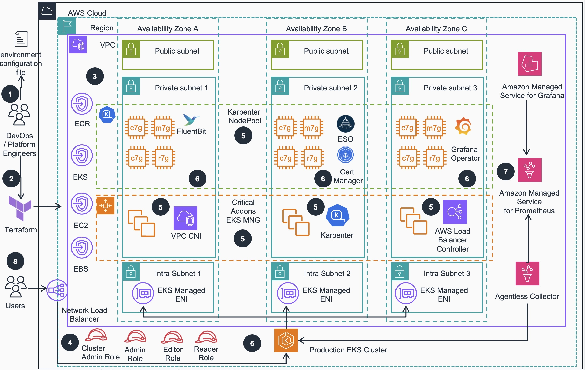
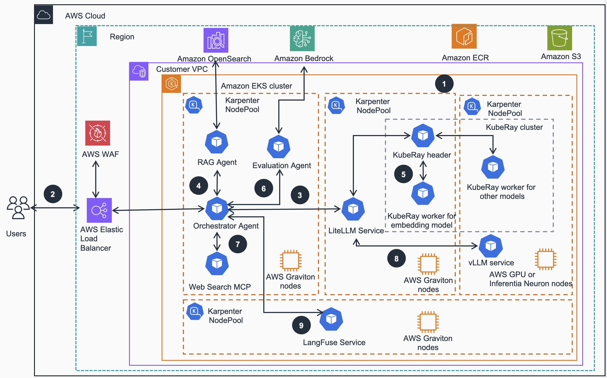

# Cost Effective and Scalable Model Inference and Agentic AI on Amazon EKS

## Table of Contents

- [Overview](#overview)
- [Architecture](#architecture)
- [Architecture Steps](#architecture-steps)
- [Plan Your Deployment](#plan-your-deployment)
  - [Cost](#cost)
  - [Sample Cost Table](#sample-cost-table)
  - [Security](#security)
  - [Supported AWS regions](#supported-aws-regions)
  - [Service Quotas](#service-quotas)
  - [Third party dependencies disclaimer](#third-party-dependencies-disclaimer)
- [Quick Start Guide](#quick-start-guide)
  - [Important Setup Instructions](#️-important-setup-instructions)    
- [Important Notes](#important-notes)
    - [Architecture Benefits](#-architecture-benefits)
    - [Key Improvements](#-key-improvements)
- [Notices](#notices)
    
## Overview
This solution implements a comprehensive, scalable ML inference architecture using Amazon EKS with AutoMode, leveraging AWS Graviton processors for cost-effective CPU-based inference and GPU and AWS Inferentia instances for accelerated inference. The system provides a complete end-to-end platform for deploying large language models with Agentic AI capabilities, including RAG (Retrieval Augmented Generation) and intelligent document processing.


## Architecture

### Infrastructure Architecture

_Figure1. Reference Architecture for EKS cluster with add-ons_

### Agentic Application Architecture

_Figure2. Reference Architecture Gen AI applications deployed on the EKS cluster_

The architecture diagrams illustrate our scalable ML inference solution with the following components:

1. **Amazon EKS Cluster**: The foundation of our architecture, providing a managed Kubernetes environment with automated provisioning and configuration.
   
2. **Managed Karpenter Auto-scaling**: Dynamically provision and scale compute resources based on workload demands across multiple node pools.
   
3. **Node Pools**:
   - **Graviton-based nodes (ARM64)**: Cost-effective CPU inference using m8g/c8g instances
   - **GPU-based nodes (x86_64)**: High-performance inference using NVIDIA GPU instances (g5, g6 families)
   - **x86-based nodes**: General purpose compute for compatibility requirements
   - **Inferentia-based nodes**: High-performance inference using Inferentia (inf2) instances 
   
4. **Model Hosting Services**:
   - **Ray Serve**: Distributed model serving with automatic scaling using 
   - **Standalone Services**: Direct model deployment for specific use cases
   - **Multi-modal Support**: Text, vision, and reasoning model hiosting capabilities
   
5. **Model Gateway**: 
   - **LiteLLM Proxy**: Unified OpenAI-compatible API gateway with load balancing and routing
   - **Ingress Controller**: External access management with SSL termination
   
6. **Agentic AI Applications**:
   - **RAG with OpenSearch**: Intelligent document retrieval and question answering
   - **Intelligent Document Processing (IDP)**: Automated document analysis and extraction
   - **Multi-Agent Systems**: Coordinated Agentic AI workflows with specialized agents
   
7. **Observability & Monitoring**: 
   - **Langfuse**: LLM observability and performance tracking
   - **Prometheus & Grafana**: Infrastructure monitoring and alerting

This architecture provides flexibility to choose between cost-optimized CPU inference on Graviton processors or high-throughput GPU inference based on your specific requirements, all while maintaining elastic scalability through Kubernetes and Karpenter.

## Architecture Steps

1. **Foundation Setup**: The foundation begins with an Amazon EKS cluster, configured for application readiness and with compute plane managed by Karpenter. This setup efficiently provisions both AWS Graviton and GPU based instances across multiple Availability Zones (AZs), ensuring robust infrastructure distribution and high availability of various Kubernetes services.

2. **User Request Entry**: User interaction starts through HTTP requests directed to an exposed endpoint, managed by Elastic Load Balancing (ELB). This entry point serves as the gateway for all user queries and ensures balanced distribution of incoming traffic while maintaining consistent accessibility.

3. **Orchestration and Analysis**: The orchestrator agent, powered by Strands Agent SDK, serves as the central coordination hub. It processes incoming queries by connecting with reasoning models supported by LiteLLM and vLLM services, analyzing the requests, and determining the appropriate workflow and tools needed for response generation. LiteLLM functions as a unified API gateway for model management, providing centralized security controls and standardized access to both embedding and reasoning models.

4. **Knowledge Validation**: Knowledge validation begins as the orchestrator agent delegates to the RAG agent to verify knowledge base currency. When updates are needed, the RAG agent initiates the process of embedding new information into the Amazon Opensearch cluster, ensuring the knowledge base remains current and comprehensive.

5. **Embedding Process**: The embedding process is handled within a KubeRay cluster, where the Ray header dynamically manages worker node scaling based on resource demands. These worker nodes execute the embedding process through the llamacpp framework, while the RAG agent simultaneously embeds user questions and searches for relevant information within the OpenSearch cluster.

6. **Quality Assurance**: Quality assurance is performed by the Evaluation Agent, which leverages models hosted in Amazon Bedrock. This agent implements a feedback-based correction loop using RAGAS metrics to assess response quality and provides relevancy scores to the orchestrator agent for decision-making purposes.

7. **Web Search Fallback**: When the RAG agent's responses receive low relevancy scores, the orchestrator agent initiates a web search process. It retrieves the Tavily web search API tool from the web search MCP server and performs dynamic queries to obtain supplementary or corrective information.

8. **Final Response Generation**: The final response generation occurs on GPU instances running vLLM. The reasoning model processes the aggregated information, including both knowledge base data and web search results when applicable, refining and rephrasing the content to create a coherent and accurate response for the user.

9. **Comprehensive Tracking**: Throughout this entire process, the Strands Agent SDK maintains comprehensive interaction tracking. All agent activities and communications are automatically traced, with the resulting data visualized through the Langfuse service, providing complete transparency and monitoring of the system's operations.


## Plan your deployment

### Cost

You are responsible for the cost of the AWS services used while running this guidance. 
As of November 2025, the cost for running this guidance with the default settings in the US East (N. Virginia) Region is approximately **$447.47/month**.

We recommend creating a [budget](https://alpha-docs-aws.amazon.com/awsaccountbilling/latest/aboutv2/budgets-create.html) through [AWS Cost Explorer](http://aws.amazon.com/aws-cost-management/aws-cost-explorer/) to help manage costs. Prices are subject to change. For full details, refer to the pricing webpage for each AWS service used in this guidance.

### Sample Cost Table

The following table provides a sample cost breakdown for deploying this guidance with the default parameters in the `us-east-1` (N. Virginia) Region for one month. This estimate is based on the AWS Pricing Calculator output for the full deployment as per the guidance and as of November, 2025 was around **$447.47/mo** in the `us-east-1` region.

| **AWS service** | Dimensions | Cost, month [USD] |
|-----------------|------------|-------------------|
| Amazon EKS | 1 cluster | $73.00 |
| Amazon VPC | 3 NAT Gateways | $98.67 |
| Amazon EC2 | 2 m6g.large instances | $112.42 |
| Amazon Managed Service for Prometheus (AMP) | Metric samples, storage, and queries | $100.60 |
| Amazon Managed Grafana (AMG) | Metrics visualization - Editor and Viewer users | $14.00 |
| Amazon EBS | gp2 storage volumes and snapshots | $17.97 |
| Application Load Balancer | 1 ALB for workloads | $16.66 |
| Amazon VPC | Public IP addresses | $3.65 |
| AWS Key Management Service (KMS) | Keys and requests | $7.00 |
| Amazon CloudWatch | Metrics | $3.00 |
| Amazon ECR | Data storage | $0.50 |
| **TOTAL** |  | **$447.47/month** |

For a more accurate estimate based on your specific configuration and usage patterns, we recommend using [AWS Pricing Calculator](https://calculator.aws).

## Security

When you build systems on AWS infrastructure, security responsibilities are shared between you and AWS. 
This [shared responsibility model](https://aws.amazon.com/compliance/shared-responsibility-model/) reduces your operational burden because AWS operates, manages, 
and controls the components including the host operating system, the virtualization layer, and the physical security of the facilities in which the services operate. 
For more information about AWS security, visit [AWS Cloud Security](http://aws.amazon.com/security/).

This guidance implements several security best practices and AWS services to enhance the security posture of your EKS Workload Ready Cluster. Here are the key security components and considerations:

### Identity and Access Management (IAM)

- **IAM Roles**: The architecture uses predefined IAM roles (Cluster Admin, Admin, Edit, Read) to manage access to the EKS cluster resources. 
This follows the principle of least privilege, ensuring users and services have only the permissions necessary to perform their tasks.
- **EKS Managed Node Groups**: These use IAM roles with specific permissions required for nodes to join the cluster and for pods to access AWS services.

### Network Security

- **Amazon VPC**: The EKS cluster is deployed within a custom VPC with public and private subnets across multiple Availability Zones, providing network isolation.
- **Security Groups**: Although not explicitly shown in the diagram, security groups are typically used to control inbound and outbound traffic to EC2 instances and other resources within the VPC.
- **NAT Gateways**: Deployed in public subnets to allow outbound internet access for resources in private subnets while preventing inbound access from the internet.

### Data Protection

- **Amazon EBS Encryption**: EBS volumes used by EC2 instances are typically encrypted to protect data at rest.
- **AWS Key Management Service (KMS)**: Used for managing encryption keys for various services, including EBS volume encryption.

### Kubernetes-specific Security

- **Kubernetes RBAC**: Role-Based Access Control is implemented within the EKS cluster to manage fine-grained access to Kubernetes resources.
- **AWS Certificate Manager**: Integrated to manage SSL/TLS certificates for secure communication within the cluster.

### Monitoring and Logging

- **Amazon CloudWatch**: Used for monitoring and logging of AWS resources and applications running on the EKS cluster.
- **Amazon Managed Grafana and Prometheus**: Provide additional monitoring and observability capabilities, helping to detect and respond to security events.

### Container Security

- **Amazon ECR**: Stores container images in a secure, encrypted repository. It includes vulnerability scanning to identify security issues in your container images.

### Secrets Management

- **AWS Secrets Manager**: While not explicitly shown in the diagram, it's commonly used to securely store and manage sensitive information such as database credentials, API keys, and other secrets used by applications running on EKS.

### Additional Security Considerations

- Regularly update and patch EKS clusters, worker nodes, and workload container images.
- Implement network policies to control pod-to-pod communication within the cluster.
- Use Pod Security Policies or Pod Security Standards to enforce security best practices for pods.
- Implement proper logging and auditing mechanisms for both AWS and Kubernetes resources.
- Regularly review and rotate IAM and Kubernetes RBAC permissions.

## Supported AWS Regions

Guidance for Scalable Model Inference and Agentic AI  on Amazon EKS is supported in the following AWS Regions:

| Region Name | Region Code |
|-------------|-------------|
| US East (N. Virginia) | us-east-1 |
| US East (Ohio) | us-east-2 |
| US West (Oregon) | us-west-2 |
| Asia Pacific (Mumbai) | ap-south-1 |
| Asia Pacific (Seoul) | ap-northeast-2 |
| Asia Pacific (Singapore) | ap-southeast-1 |
| Asia Pacific (Sydney) | ap-southeast-2 |
| Asia Pacific (Tokyo) | ap-northeast-1 |
| Europe (Frankfurt) | eu-central-1 |
| Europe (Ireland) | eu-west-1 |
| Europe (London) | eu-west-2 |
| Europe (Paris) | eu-west-3 |
| Europe (Stockholm) | eu-north-1 |
| South America (São Paulo) | sa-east-1 |

## Service Quotas

Service quotas, also referred to as limits, are the maximum number of service resources or operations for your AWS account.

### Quotas for AWS services in this Guidance

Make sure you have sufficient quota for each of the AWS services implemented in this solution (see [AWS Services in this guidance](#aws-services-in-this-Guidance)).
For more information, see [AWS service quotas](https://docs.aws.amazon.com/general/latest/gr/aws_service_limits.html).

To view the service quotas for all AWS services in the documentation without switching pages, view the information in the 
[Service endpoints and quotas](https://docs.aws.amazon.com/general/latest/gr/aws-general.pdf#aws-service-information)
page in the PDF format.


## Third-Party Dependencies Disclaimer

This sample code utilizes various third-party packages, modules, models, and datasets, including but not limited to:

- Strands Agent SDK
- Qwen3-14B
- snowflake-arctic-embed-s model
- LiteLLM
- LangFuse
- Medical Text for Text Classification public dataset

**Important Notice:**
- Amazon Web Services (AWS) is not associated to these third-party entities and their components.
- The maintenance, updates, and security of these third-party dependencies are the sole responsibility of the customer/user.
- Users should regularly review and update these dependencies to ensure security and compatibility.
- Users are responsible for compliance with all applicable licenses and terms of use for these third-party components.

Please review and comply with all relevant licenses and terms of service for each third-party component before using in your applications.

## Quick Start Guide

### ⚠️ Important Setup Instructions

**Before proceeding with this solution, ensure you have:**

1. **AWS CLI configured** with appropriate permissions for EKS, ECR, CloudFormation, and other AWS services
2. **kubectl installed** and configured to access your target AWS region
3. **Docker installed** and running (required for building and pushing container images)
4. **Sufficient AWS service quotas** - This solution requires multiple EC2 instances, EKS clusters, and other AWS resources
5. **Valid Hugging Face token** - Required for accessing models (see instructions below)
6. **Tavily API key** - Required for web search functionality in agentic applications

**Recommended Setup Verification:**
```bash
# Verify AWS CLI access
aws sts get-caller-identity

# Verify kubectl installation
kubectl version --client

# Verify Docker is running
docker ps

# Check available AWS regions and quotas
aws ec2 describe-regions
aws service-quotas get-service-quota --service-code ec2 --quota-code L-1216C47A
```

**Cost Awareness:** This solution will incur AWS charges. Review the cost breakdown section below and set up billing alerts before deployment.

>NOTE: For detailed instructions on Deployment options for this guidance, running model infrenece and Agentic AI workflows and uninstallation please see 
this [Detailed Installation Guide](https://aws-solutions-library-samples.github.io/compute/scalabale-model-inference-and-agentic-ai-on-amazon-eks.html)


## Important Notes

### 🔍 Architecture Benefits

1. **Modularity**: Each agent has specific responsibilities
2. **Scalability**: Agents can be scaled independently  
3. **Reliability**: Isolated failures don't affect the entire system
4. **Extensibility**: Easy to add new capabilities
5. **Observability**: Comprehensive monitoring and tracing via Strands SDK
6. **Standards Compliance**: Uses MCP for tool integration and OpenTelemetry for tracing

### 🔧 Key Improvements

##### Unified Architecture
- **Single Codebase**: No separate "enhanced" versions - all functionality is built into the standard agents
- **Built-in Tracing**: OpenTelemetry tracing is automatically enabled through Strands SDK
- **Simplified Deployment**: One main application with all features included
- **Consistent API**: All agents use the same tracing and configuration patterns

#### Enhanced Developer Experience
- **Automatic Instrumentation**: No manual trace management required
- **Multiple Export Options**: Console, OTLP, Jaeger, Langfuse support out of the box
- **Environment-based Configuration**: Easy setup through environment variables
- **Clean Code Structure**: Removed duplicate wrapper functions and complex manual tracing
- **Async Warning Management**: Clean test runner filters harmless async cleanup warnings
- **Robust Error Handling**: Fallback mechanisms ensure system reliability

## Notices 

*Customers are responsible for making their own independent assessment of the information in this Guidance. This Guidance: (a) is for informational purposes only, (b) represents AWS current product offerings and practices, which are subject to change without notice, and (c) does not create any commitments or assurances from AWS and its affiliates, suppliers or licensors. AWS products or services are provided “as is” without warranties, representations, or conditions of any kind, whether express or implied. AWS responsibilities and liabilities to its customers are controlled by AWS agreements, and this Guidance is not part of, nor does it modify, any agreement between AWS and its customers.*
