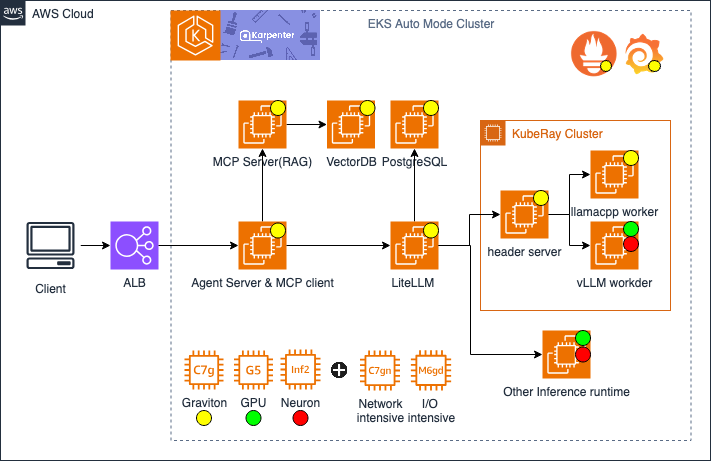

# Multi-Agent RAG with MCP and OpenSearch

This project implements a multi-agent Large Language Model (LLM) system that combines Model Context Protocol (MCP) for tool usage and Retrieval Augmented Generation (RAG) for enhanced context awareness, using OpenSearch as the vector database.

## Architecture


## Project Overview

This application creates a multi-agent AI system that can:
1. **Automatically detect and embed knowledge changes** using a Knowledge Agent
2. **Retrieve relevant information** from a knowledge base using vector embeddings stored in OpenSearch via a RAG Agent
3. **Interact with external tools** through the Model Context Protocol (MCP) via an MCP Agent
4. **Coordinate the entire workflow** through a Supervisor Agent
5. **Complete complex tasks** like summarizing content and saving results to files

## Multi-Agent Architecture

The system is built with a modular multi-agent architecture consisting of these key components:

```
SupervisorAgent → Manages the overall workflow and coordinates all agents
  ├── KnowledgeAgent → Monitors knowledge changes and handles embedding
  │   └── EmbeddingRetriever → Creates and manages document embeddings
  │       └── OpenSearchVectorStore → Stores and searches document embeddings
  ├── RAGAgent → Handles context retrieval and semantic search
  │   └── EmbeddingRetriever → Performs vector search for relevant context
  └── MCPAgent → Manages tool interactions and LLM communication
      ├── ChatOpenAI → Handles LLM interactions and tool calling
      └── MCPClient(s) → Connects to MCP servers for tool access
```

## Multi-Agent Workflow

1. **Supervisor Initialization**:
   - The SupervisorAgent initializes all sub-agents
   - Each agent sets up its required resources and connections

2. **Knowledge Management (KnowledgeAgent)**:
   - Scans the knowledge directory for file changes
   - Compares file hashes and modification times
   - Automatically embeds new or modified documents
   - Supports both markdown/text files and CSV files
   - Maintains metadata to track changes efficiently

3. **Context Retrieval (RAGAgent)**:
   - Converts user queries to embeddings
   - Searches for the most relevant documents using cosine similarity in OpenSearch
   - Supports advanced features like reranking and hybrid search
   - Returns structured context for the LLM

4. **Task Execution (MCPAgent)**:
   - Receives the user query and retrieved context
   - Initializes the LLM with appropriate system prompts
   - Manages tool calls through MCP protocol
   - Handles multi-turn conversations with tool interactions

5. **Workflow Coordination (SupervisorAgent)**:
   - Orchestrates the entire process from start to finish
   - Manages task queues and results
   - Provides comprehensive workflow summaries
   - Handles error recovery and cleanup

## Key Components

### SupervisorAgent
- **Purpose**: Orchestrates the entire multi-agent workflow
- **Responsibilities**: Task management, agent coordination, result aggregation
- **Features**: Task queuing, result tracking, workflow summaries

### KnowledgeAgent
- **Purpose**: Manages knowledge base updates and embeddings
- **Responsibilities**: Change detection, document embedding, metadata management
- **Features**: File monitoring, hash-based change detection, CSV support

### RAGAgent
- **Purpose**: Handles context retrieval and semantic search
- **Responsibilities**: Vector search, document ranking, context preparation
- **Features**: Semantic search, hybrid search, document reranking

### MCPAgent
- **Purpose**: Manages LLM interactions and tool usage
- **Responsibilities**: Tool orchestration, conversation management, task execution
- **Features**: Multi-tool support, conversation history, error handling

## Getting Started

### Prerequisites

- Node.js 18+
- pnpm or npm
- OpenAI API key
- AWS OpenSearch Domain
- AWS credentials configured

### Installation

```bash
# Clone the repository
git clone <repository-url>

# Go to the right path
cd agentic-apps/agentic_rag_opensearch

# Install dependencies
pnpm install

# Set up environment variables
# Create a .env file with:
OPENAI_API_KEY=your-api-key
OPENAI_BASE_URL=your-model-hosting-endpoint
OPENSEARCH_ENDPOINT=your-opensearch-endpoint
AWS_REGION=your-aws-region
LANGFUSE_HOST=
LANGFUSE_PUBLIC_KEY=
LANGFUSE_SECRET_KEY=
```

### Usage

```bash
# Embed all knowledge documents (markdown, text, JSON, and CSV files with change detection)
pnpm embed-knowledge

# Run the multi-agent application
pnpm dev

# Test the multi-agent system
pnpm test-agents
```

## Multi-Agent Features

### Intelligent Knowledge Management
- **Automatic Change Detection**: Monitors file modifications using hashes and timestamps
- **Incremental Updates**: Only processes changed files to improve efficiency
- **Multi-format Support**: Handles markdown, text, JSON, and CSV files in a unified workflow
- **Metadata Persistence**: Maintains state across application restarts

### Advanced RAG Capabilities
- **Semantic Search**: Vector-based similarity search using OpenSearch
- **Hybrid Search**: Combines keyword and semantic search (extensible)
- **Document Reranking**: Improves relevance of retrieved documents
- **Context Optimization**: Structures context for optimal LLM performance

### Robust Tool Integration
- **MCP Protocol**: Standardized tool communication
- **Multi-tool Support**: Can integrate multiple MCP servers
- **Error Handling**: Graceful handling of tool failures
- **Conversation Management**: Maintains context across tool interactions

### Workflow Orchestration
- **Task Queuing**: Manages complex multi-step workflows
- **Result Tracking**: Comprehensive logging of all agent activities
- **Error Recovery**: Handles failures gracefully with detailed reporting
- **Resource Management**: Proper cleanup and connection management

## Example Use Case

The current implementation demonstrates a comprehensive workflow where the system:
1. **Automatically checks** for knowledge base changes and updates embeddings if needed
2. **Retrieves relevant information** about Bell's palsy treatment from the knowledge base
3. **Generates a comprehensive report** with multiple sections and detailed information
4. **Saves the output** to a markdown file using the filesystem MCP tool
5. **Provides detailed workflow summaries** and task results

## Extending the Multi-Agent System

This modular architecture can be easily extended:

### Adding New Agents
- Create specialized agents for specific domains (e.g., WebSearchAgent, DatabaseAgent)
- Implement the common agent interface for seamless integration
- Register with the SupervisorAgent for workflow coordination

### Enhanced Knowledge Management
- Add support for more file formats (PDF, DOCX, etc.)
- Implement intelligent chunking strategies
- Add knowledge graph capabilities
- Integrate with external knowledge sources

### Advanced RAG Features
- Implement query expansion and refinement
- Add multi-modal search capabilities
- Integrate with specialized embedding models
- Implement adaptive retrieval strategies

### Tool Ecosystem Expansion
- Add more MCP servers for different tool categories
- Implement custom tool validation and security
- Add tool usage analytics and optimization
- Create tool recommendation systems

### Production Deployment
- Add comprehensive monitoring and logging
- Implement horizontal scaling capabilities
- Add authentication and authorization
- Deploy as microservices with API gateways

## Architecture Benefits

1. **Modularity**: Each agent has a specific responsibility, making the system maintainable
2. **Scalability**: Agents can be scaled independently based on workload
3. **Reliability**: Isolated failures don't bring down the entire system
4. **Extensibility**: New capabilities can be added without modifying existing agents
5. **Testability**: Each agent can be tested in isolation
6. **Observability**: Detailed tracking of all agent interactions and results
